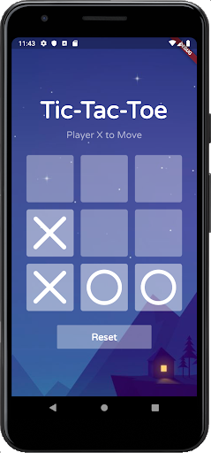

# Team McLaren Portfolio

### Tic Tac Toe
A simple game to demonstrate
  - flutter layout 
  - animation
  - separation of model classes from flutter view code
  
Code developed by a few students is available here:
  - [Kapil J. - Tic Tac Toe](https://github.com/Flutter-Kapil/tic_tac_toe_refactoring_starter)
  - [Sahil S. - Tic Tac Toe](https://github.com/fuser312/tic_tac_toe_refactoring_starter)
  - [Sahil S. - Tic Tac Toe](https://github.com/mvresh/tic_tac_toe_refactoring_starter)
  

### Flutter Fox
A MacOS Flutter App written by Mark McLaren to interface with 
the [Whiteboard Fox web app](https://whiteboardfox.com) (which was also written by Mark).

MacOS users can run the app by clicking 
'Launch Whiteboard Fox' on [this page](https://feather-apps.com).

#### [Click here to view the video](https://youtu.be/dWvd_t74IFQ) 

